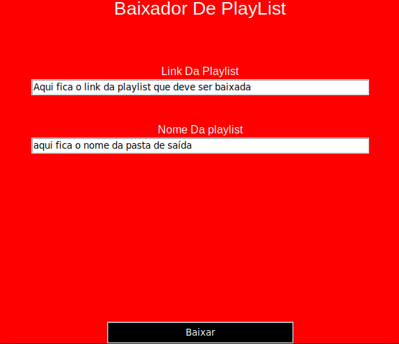

<h1>Baixador de PlayList<h1>

<h2>Programa que baixa Playlists do YouTube</h2>

Necessário: 

<ul>
    <li>Python (3.x)</li>
    <li>Módulo Pytube</li>
</ul>

<h3>Como usar: </h3>

<ul>
    <li>Execute o arquivo 'playlist.py'</li>
    <li>Coloque o Link da playlist desejada no primeiro campo</li>
    <li>Coloque o nome da pasta de saída no segundo campo (exemplo: minha_playlist)</li>
    <li>Clique no botão de baixar</li>
</ul>

